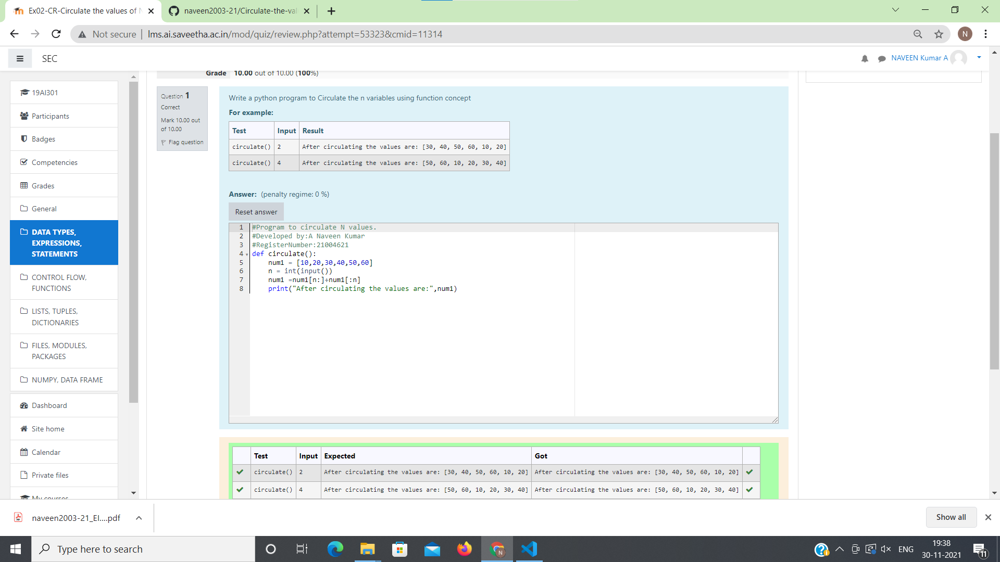

# Circulate-the-values-of-N-variables
## Aim:
To write a python program to circulate the n variables using function concept
## Equipment’s required:
PC
Anaconda - Python 3.7
## Algorithm: 
### Step 1: Get the values from the user.
### Step 2: prepare program for circulate the values.
### Step 3: using num[n:]+num1[:n],we can circulate the values
Get the value from the user for the number of rotation
### Step 4: 
Using the slicing concept rotate the list
### Step 5:
to find the circulate the values of n variables
## Program:
#Program to circulate N values.

#Developed by:A Naveen Kumar

#RegisterNumber:21004621

def circulate():

    num1 = [10,20,30,40,50,60]

    n = int(input()) 

    num1 =num1[n:]+num1[:n]

    print("After circulating the values are:",num1)
## Output:

## Result:
Thus the circulate of values are successfully executed.